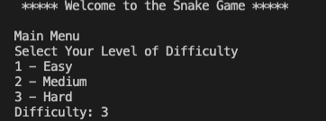
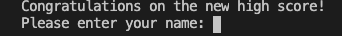
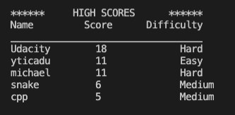

# CPPND: Capstone Snake Game

This is a repo for the Capstone project in the [Udacity C++ Nanodegree Program](https://www.udacity.com/course/c-plus-plus-nanodegree--nd213). The code for this repo was inspired by [this](https://codereview.stackexchange.com/questions/212296/snake-game-in-c-with-sdl) excellent StackOverflow post and set of responses.

The Capstone Project gives you a chance to integrate what you've learned throughout this program. This project will become an important part of your portfolio to share with current and future colleagues and employers.

In this project, you can build your own C++ application or extend this Snake game, following the principles you have learned throughout this Nanodegree Program. This project will demonstrate that you can independently create applications using a wide range of C++ features.

## Dependencies for Running Locally
* cmake >= 3.7
  * All OSes: [click here for installation instructions](https://cmake.org/install/)
* make >= 4.1 (Linux, Mac), 3.81 (Windows)
  * Linux: make is installed by default on most Linux distros
  * Mac: [install Xcode command line tools to get make](https://developer.apple.com/xcode/features/)
  * Windows: [Click here for installation instructions](http://gnuwin32.sourceforge.net/packages/make.htm)
* SDL2 >= 2.0
  * All installation instructions can be found [here](https://wiki.libsdl.org/Installation)
  * Note that for Linux, an `apt` or `apt-get` installation is preferred to building from source.
* gcc/g++ >= 5.4
  * Linux: gcc / g++ is installed by default on most Linux distros
  * Mac: same deal as make - [install Xcode command line tools](https://developer.apple.com/xcode/features/)
  * Windows: recommend using [MinGW](http://www.mingw.org/)

## Basic Build Instructions

1. Clone this repo.
2. Make a build directory in the top level directory: `mkdir build && cd build`
3. Compile: `cmake .. && make`
4. Run it: `./SnakeGame`.

## Overview of Code Structure
This project introduces two new classes:

## Menu ##
The `Menu` class is responsible for accepting user input to select the game's difficulty. 

The available choices are `Easy`, `Medium`, and `Hard`, whereby the `Snake`'s initial speed and rate of increase doubles between levels (handled in the `Snake` and `Game` classes, respectively). Furthermore, this selection is used to display the difficulty during the game, as well as alongside high scores in the scoreboard.

## Scoreboard ##
The `Scoreboard` class is responsible for reading and writing to the `high_scores.txt` file, as well as keeping track and sorting the game's history of top ten high scores.

If, at the end of play, a player's score is one of the ten highest recorded scores, s/he is asked to provide their name to be added to the list of ten highest scores:

At the conclusion of the game the scoreboard of ten highest scores is displayed to the player:

## Rubric* ##
### Loops, Functions, I/O
| Criteria | Meets Specifications |
| -------- | -------------------- |
| The project demonstrates an understanding of C++ functions and control structures. | The project is clearly organized into functions that utilize control structures in classes Menu, Scoreboard, and Utilities. |
| The project reads data from a file and process the data, or the program writes data to a file. | The scoreboard file is read from and written to the high_scores.txt file. |
| The project accepts user input and processes the input. | Users select the game's difficulty prior to the start of the game (in Menu class) and provide thier name when achieving a high score (in Scoreboard classs). |

 

### Object Oriented Programming
| Criteria | Meets Specifications |
| -------- | -------------------- |
| The project uses Object Oriented Programming techniques. | The project code is organized into `Menu` and `Scoreboard` classes with attributes that hold the data, and methods that perform tasks. |
| Classes use appropriate access specifiers for class members. | Access to all class data members are explicitly specified as public, private in the `Menu` and `Scoreboard` classes. |
| Class constructors utilize member initialization lists. | All class members that are set to argument values are initialized through member initialization lists. |
| Classes abstract implementation details from their interfaces.| All class member functions document their effects, either through function names, comments, or formal documentation. Member functions do not change program state in undocumented ways. |
| Classes encapsulate behavior. | Appropriate data and functions are grouped into classes. Member data that is subject to an invariant is hidden from the user. State is accessed via member functions.
| Classes follow an appropriate inheritance hierarchy. | The `Scoreboard` class is composed of a `vector` of class `Entry` |

 

### Memory Management

| Criteria | Meets Specifications |
| -------- | -------------------- |
|The project follows the Rule of 5.| For all classes, if any one of the copy constructor, copy assignment operator, move constructor, move assignment operator, and destructor are defined, then all of these functions are defined. This is relevant to the nested class `Entry` in the class `Scoreboard`.|
|The project uses move semantics to move data, instead of copying it, where possible.|For classes with move constructors, the project returns objects of that class by value, and relies on the move constructor, instead of copying the object. This is true for the nested `Entry` class, particulary when an `entry` is created and passed to the `scoreboard`.|

 
* This section assumes familiarity with the base project and therefore omits reference to the provided code and only discusses the additions that have been made by me.